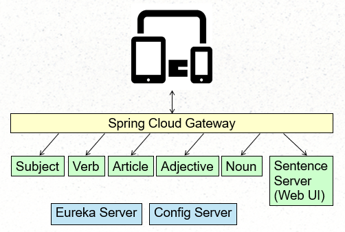

## Lab 9 - Spring Cloud Gateway

In this lab, we will use the Spring Cloud Gateway as the entry point for all external traffic into our application.  The root resource ("/") will route to the sentence server, which will return a simple user interface, and the word servers will serve up their individual words.  JavaScript within a web page will retrieve word values by making calls to the individual services via the Gateway.   




  **Part 1 - Startup**

1.  Stop ALL of the services that you may have running from previous exercises.  If using an IDE you may also wish to close all of the projects that are not related to "lab-9”.

1.  Start the common-config-server and common-eureka-server.  

1.  Lab 9 has copies of the word server.  Start 5 separate copies of the **lab-9/word-server**, using the profiles "subject", "verb", "article", "adjective", and "noun".  There are several ways to do this, depending on your preference:

    - If you wish to use Maven, open separate command prompts in the target directory and run these commands:
      - mvn spring-boot:run -Dspring.profiles.active=subject
      - mvn spring-boot:run -Dspring.profiles.active=verb
      - mvn spring-boot:run -Dspring.profiles.active=article
      - mvn spring-boot:run -Dspring.profiles.active=adjective
      - mvn spring-boot:run -Dspring.profiles.active=noun

    - If you wish to build the code and run the JAR, run `mvn package` in the project's root.  Then open separate command prompts in the target directory and run these commands:
      - java -jar -Dspring.profiles.active=subject   lab-9-word-server-1.jar 
      - java -jar -Dspring.profiles.active=verb      lab-9-word-server-1.jar 
      - java -jar -Dspring.profiles.active=article   lab-9-word-server-1.jar 
      - java -jar -Dspring.profiles.active=adjective lab-9-word-server-1.jar 
      - java -jar -Dspring.profiles.active=noun      lab-9-word-server-1.jar 

    - **IntelliJ** Open lab-9/word-server.  
      * Use menu "Run" / "Edit Configurations".  
      * Press "+" to add new configuration. Select "Application".  
      * Choose Name=noun, Main class=demo.Application.  
      * Click "Modify Options" / "Add VM Options".  
      * Enter `-Dspring.profiles.active=noun` in new field.
      * Apply.  Run.  
      * Repeat this process (or copy the run configuration) for the profiles "verb", "article", "adjective", "noun".

    - **Eclipse/STS** Import lab-9/word-server into your workspace.
      * R-click on the project, Run As... / Run Configurations... .
      * From the Spring Boot tab specify a Profile of "subject", 
      * UNCHECK JMX port / live bean support, and Run.  
      * Repeat this process (or copy the run configuration) for the profiles "verb", "article", "adjective", "noun".

1.  Check [Eureka](http://localhost:8010).   Any warnings about running a single instance are expected.  Ensure that each of your 5 applications are eventually listed in the "Application" section, bearing in mind it may take a few moments for the registration process to be 100% complete.	

1.  Optional - If you wish, you can click on the link to the right of any of these servers.  Replace the "actuator/info" with "/" and refresh several times.  You can observe the randomly generated words.  

1.  In a separate IDE, open **lab-9/sentence-server**.  Run this application.  Access it at [http://localhost:8088](http://localhost:8088).  
    * Expect to encounter errors in the page at this point.  The JavaScript / AJAX calls in the page have no knowledge of service discovery or the actual whereabouts of the word servers.
    

    **Part 2 - Build the API Gateway**

1.  Open **lab-9/gateway**.  This is a simple Spring Boot web application which we will modify to be an API Gateway.

1.  Add the dependencies for:
    * Config client ( `org.springframework.cloud` / `spring-cloud-config-client`).
    * Eureka-based service discovery (`org.springframework.cloud` / `spring-cloud-starter-netflix-eureka-client`).
    * Spring Cloud Load Balancer (`org.springframework.cloud` / `spring-cloud-starter-loadbalancer`)
    * Spring Cloud Gateway (`org.springframework.cloud` / `spring-cloud-starter-gateway-mvc`).

    >  If using IntelliJ, the Maven extension may require you to update your project at this point.  From the menu, View / Maven / Refresh all...

    >  If using Eclipse, the M2E plugin may require you to update your project at this point.  Right click on the project / Maven / Update Project

1.  Setup the application to obtain configuration from the config server on startup.  Do you remember how to do this?  Open application.yml and add the location of the configuration server.  For a reminder how to do this, consult the configuration of the word server.

    **Part 3 - Add Routes**

1.  Within application.yml, add a route for the "subject" service with the following entry:

    ```
      cloud:
        gateway:
          routes:

          # Any request to /services/subject should route
          # through the load balancer to
          # the subject service's "/" resource:
          - id: subject-service
            uri: lb://subject
            predicates:
            - Path=/services/subject/**
            filters:
            - StripPrefix=2
    ```

    * All routes are described under `spring.cloud.gateway.routes`.  Since the `spring` root level was already established, make sure you indent `cloud` to be underneath it.
    * Each route has an id, uri, predicate, and optionally filters.
      * Id needs to be unique and descriptive.
      * Uri describes where to route to.  "lb" means to use the Spring Cloud Load Balancer.  "subject" is understood to be a service retrieved from service discovery (eureka), which will provide the resolved address.
      * Predicates describe selection criteria; which incoming requests should go to this route?  Many options are available.  "Path" refers to the incoming request's path (after host and port).  "**" is an Ant-style description of any number of levels.  This predicate says "any request beginning with /services/subject/ and ending with anything is controlled by this route.
      * Filters are optional.  This filter is used to strip the first two "levels" of pathing before appending to the uri.  Without this setting, the resulting uri would be "http://<subject-server-and-port>/services/subject", which is not what the word server expects.  We want the uri to be "http://<subject-server-and-port>".

1.  Save your work.  Run the application.  Access [http://localhost:8080/services/subject](http://localhost:8080/services/subject).  The subject should appear in JSON form.
    * If it does not, confirm that the subject server is running.  Confirm that it appears in [Eureka](http://localhost:8010), confirm that your route definitions are defined in the correct level of the hierarchy.

1.  Once you have confirmed the "subject" entry is working, use it as a model to create four additional routes for "verb", "article", "adjective", and "noun".    

1.  Save your work.  Re-run the application.  Test access to [http://localhost:8080/services/verb](http://localhost:8080/services/verb) and the other services.


    **Part 4 - Add route for the web application**  
    
1.  Add an additional route to represent the web interface: any requests to the "/" resource should be routed via the load balancer to the "lab-9-sentence-server".

    ```
      # Fallback route:
      # Any request to / should route
      # through the load balancer to
      # the lab-9-sentence-server service's "/" resource:
      - id: web-interface
        uri: lb://lab-9-sentence-server
        predicates:
          - Path=/**

    ```
    * Route predicates are assessed in order.  Because this predicate describes the "/**" root route, make sure it is the LAST route defined.
    * Notice there is no need to filter / stripPrefixes.  When the web browser makes a request for a web resource like "css/bootstrap.min.css", it should be routed to the sentence server as "http://<sentence-server-and-port>/css/bootstrap.min.css".

**Reflection**

1.  How does the application know where the individual word services are?  Spring Cloud Gateway automatically uses Eureka service discovery.

1.  How did this application know how to contact Eureka?  We used Spring Cloud Config, and the server / repository we are using knows the location.

1.  This web site uses Thymeleaf, JQuery, and Bootstrap, though the usage of each is very rudimentary.  