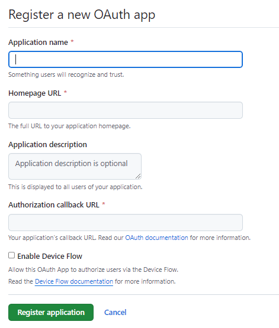

## Lab 11 - Securing the Spring Cloud Gateway with OAuth 2

In this lab, we will replace the Spring Cloud Gateway's HTTP Basic security setup with OAuth2.  Spring Cloud Gateway will require OAuth2 authorization for any user to use the application.

This lab requires the use of a GitHub account on which you can configure settings to support an OAuth2 client.  Optional steps require the use of a Google account as an alternative.  Both of these external systems work well for learning how to work with OAuth2 since they support the ability to redirect to clients running on localhost.

  **Part 1 - Startup**

1.  Stop the services that you may have running from previous exercises, except for common-config-server and common-eureka-server.  If using an IDE you may also wish to close all of the projects that are not related to "lab-11”.

1.  Start the common-config-server and common-eureka-server if they are not running.  From the student files folder, open a command prompt and run these commands (they should open separate command prompts for you):

    * Windows:
    ```
    start java -jar .\common\config-server\target\common-config-server-1.jar
    start java -jar .\common\eureka-server\target\common-eureka-server-1.jar
    ```
    * Mac:
    ```
    open -a Terminal "java -jar ./common/config-server/target/common-config-server-1.jar"
    open -a Terminal "java -jar ./common/eureka-server/target/common-eureka-server-1.jar"
    ```

1.  Run the five word servers.  For convenience the *.jar file is already present in the lab-11 folder.  Open a command prompt relative to the "lab-11" folder and run the following commands (they should open separate command prompts for you):

    * Windows:
    ```
    start java -jar -Dspring.profiles.active=subject   word-server.jar 
    start java -jar -Dspring.profiles.active=verb      word-server.jar 
    start java -jar -Dspring.profiles.active=article   word-server.jar 
    start java -jar -Dspring.profiles.active=adjective word-server.jar 
    start java -jar -Dspring.profiles.active=noun      word-server.jar 
    ```
    * Mac:
    ```
    open -a Terminal "java -Dspring.profiles.active=subject -jar word-server.jar"
    open -a Terminal "java -Dspring.profiles.active=verb -jar word-server.jar"
    open -a Terminal "java -Dspring.profiles.active=article -jar word-server.jar"
    open -a Terminal "java -Dspring.profiles.active=adjective -jar word-server.jar"
    open -a Terminal "java -Dspring.profiles.active=noun -jar word-server.jar"
    ```

1.  In a separate IDE, open **lab-11/sentence-server**.  Run this application.  
    * You can access it at [http://localhost:8088](http://localhost:8088), but the sentences will produce errors.  

1.  In an IDE, open **lab-11/gateway**.  Run this application.  Access it at [http://localhost:8080](http://localhost:8080).  
    * Expect to see a web page with fully formed sentences containing random words.  This is the state of the application as of the conclusion of lab 9.  Our goal will be to add OAuth2 based security.

1.  Check [Eureka](http://localhost:8010).   Any warnings about running a single instance are expected.  Ensure that each of your applications are eventually listed in the "Application" section, bearing in mind it may take a few moments for the registration process to be 100% complete.	


    **Part 2 - Establish an OAuth2Client in GitHub** 

1. Open a web browser to [GitHub Developer Settings](https://github.com/settings/developers).  Find the option to create a new OAuth App.  The page should look similar to this: 

    

    (Note that GitHub may change their user interface at anytime without telling me!)

1. Set the following values:
    * Application Name: Anything you like
    * Homepage URL: http://localhost:8080 
    * Application description: A test client used for the Microservices with Spring Cloud course.
    * Authorization callback URL: **http://localhost:8080/login/oauth2/code/github**
        * This setting is critical; be sure it is correct.
    * Click the _Register application_ button.

1. On the following page, record the "Client ID" value.

1. Click "Generate a new client secret".  You may be asked to re-authenticate.  Find the new client secret value and record it.  Make sure you copy it properly.

1. Create two new environment variables to record these values.

    On Windows you can run:
    ```
    setx spring.security.oauth2.client.registration.github.clientId "CLIENT_ID_GOES_HERE"
    setx spring.security.oauth2.client.registration.github.clientSecret "CLIENT_SECRET_GOES_HERE"
    ```

    On Linux or Mac you can run:

    ```
    export SPRING_SECURITY_OAUTH2_CLIENT_REGISTRATION_GITHUB_CLIENTID="CLIENT_ID_GOES_HERE"
    export SPRING_SECURITY_OAUTH2_CLIENT_REGISTRATION_GITHUB_CLIENTSECRET="CLIENT_SECRET_GOES_HERE"
    ```

    > **SECURITY WARNING** Do not store live credentials in any file (such as application.properties or application.yml) that you may share publicly, such as on GitHub, BitBucket, Google Docs, etc. For the lab environment, we recommend use of environment variables for sensitive credentials.

1. Close and re-open your IDEs so they pick up the new environment variable values.


    **Part 3 - Setup the Gateway as an OAuth2 client** 

1. Return to **lab-11/gateway**. 

1. **TODO-01:** Add the dependency for Spring Boot Security, OAuth2 Client:

    ```
		<dependency>
			<groupId>org.springframework.boot</groupId>
			<artifactId>spring-boot-starter-oauth2-client</artifactId>
		</dependency>
    ```

    * This dependency includes Spring Security.  It establishes the API Gateway as an OAuth2 client.  The OAuth2 Authorization Server will be GitHub (or Google).

1. Open application.yml.  

1. **TODO-02:** Observe the existing configuration for `spring.security.oauth2.client...`.  Your environment variables will override these values:

    ```
    spring:
      security:
        oauth2:
          client:
            registration:
              github:
                clientId: DO_NOT_PLACE_CLIENT_ID_HERE
                clientSecret: DO_NOT_PLACE_CLIENT_SECRET_HERE
    ```
    * Remember, in Spring Boot, environment variables override values in application.yml. 

1. Save your work.  Allow the application to restart (or restart it yourself). 

1. Open the gateway at [http://localhost:8080](http://localhost:8080).  For best results, use an incognito / private browsing option.  
    * Your browser should be redirected to GitHub's authentication experience.  Authenticate as you normally would.
    
1. You should see a page displaying a well-formed sentence of random words.


    **Part 4 (Optional) - Establish an OAuth2Client in Google** 

1. Open a web browser to [Google - Setting up OpenID Connect](https://developers.google.com/identity/openid-connect/openid-connect#appsetup).  Follow the instructions under **Setting up OAuth 2.0**.

1. Work through the instructions through the "Obtain OAuth 2.0 credentials" section.  You should have a new OAuth Client with credentials consisting of a Client ID and a Client Secret. Record these values.

1. Create two new environment variables to record these values.

    On Windows you can run:
    ```
    setx spring.security.oauth2.client.registration.google.clientId "CLIENT_ID_GOES_HERE"
    setx spring.security.oauth2.client.registration.google.clientSecret "CLIENT_SECRET_GOES_HERE"
    ```

    On Linux or Mac you can run:

    ```
    export SPRING_SECURITY_OAUTH2_CLIENT_REGISTRATION_GOOGLE_CLIENTID="CLIENT_ID_GOES_HERE"
    export SPRING_SECURITY_OAUTH2_CLIENT_REGISTRATION_GOOGLE_CLIENTSECRET="CLIENT_SECRET_GOES_HERE"
    ```

    > **SECURITY WARNING** Do not store live credentials in any file (such as application.properties or application.yml) that you may share publicly, such as on GitHub, BitBucket, Google Docs, etc. For the lab environment, we recommend use of environment variables for sensitive credentials.

1. Close and re-open your IDEs so they pick up the new environment variable values.

1. Close any browser that you currently have open to the gateway URL.  Open the gateway at [http://localhost:8080](http://localhost:8080).  For best results, use an incognito / private browsing option.  
    * Your browser should prompt you to sign in with either GitHub or Google.  This is Spring Security's default login experience which can be replaced.
    * Choose Google.  Work through the Google authentication experience.
    
1. You should see a page displaying a well-formed sentence of random words.


    **Reflection**

1. We've removed the HTTPS used in earlier labs to keep the steps to a minimum.

1. Unlike the earlier experience with HTTP Basic, our gateway does not need to concern itself with storing or handling users and passwords.  These become the sole concern of the OAuth2 provider.

1. This copy of the Spring Cloud Gateway is based on the MVC stack rather than the Reactive stack.  This makes the security configuration a bit easier.

1. At this point, the sentence and word servers are completely insecure, relying on all calling traffic to pass through the gateway.  We can add another layer of security by having all service-to-service communications use HTTP Basic or a similar solution.

1. We could override the user experience when selecting an authentication provider, but this is a bit out of our scope.
